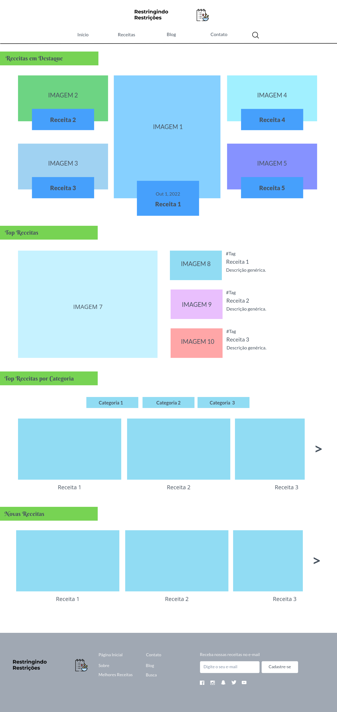
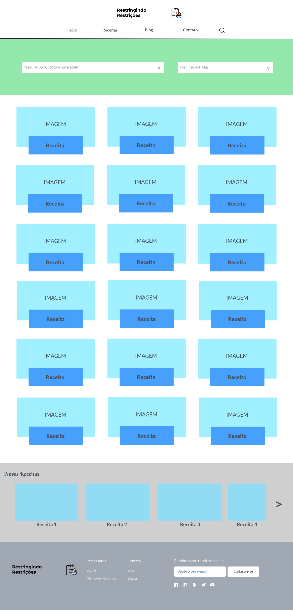
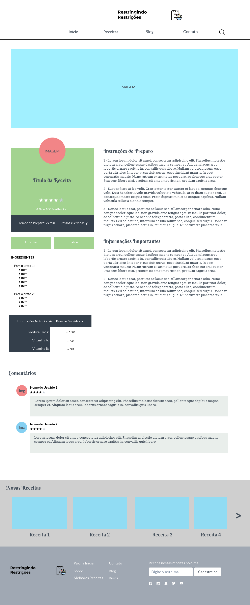
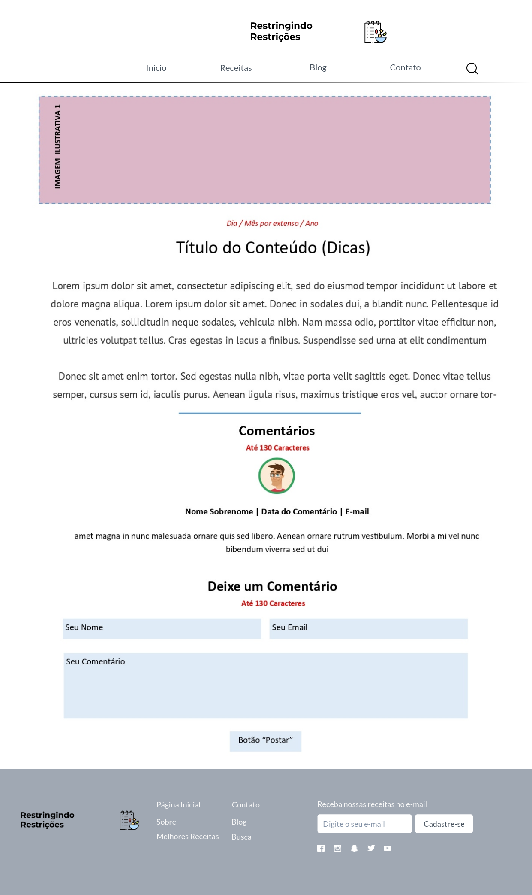
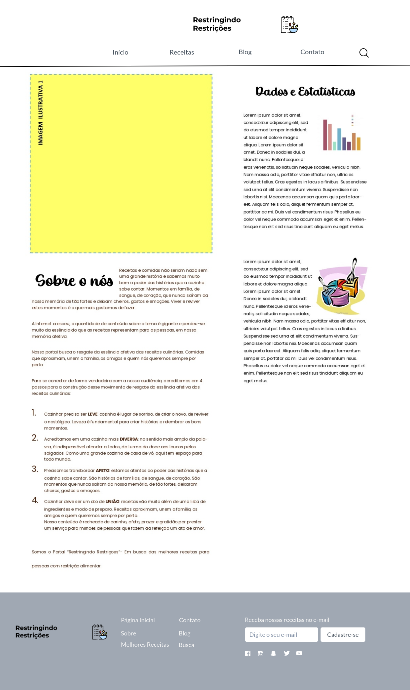
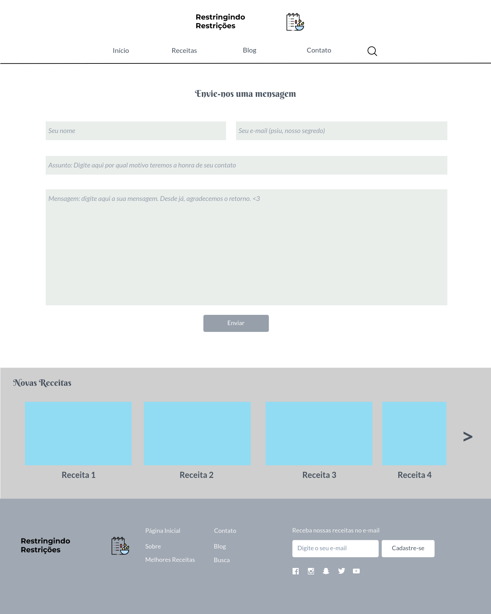

# Projeto de Interface

O projeto de interface foi desenvolvido tendo como meta a acessibilidade e a fácil compreensão do usuário. Sendo assim foi desenvolvido um layout interativo e que atende a todas as demandas de usabilidade dos usuários, com menus de acesso às diferentes páginas bem alocados. Foi padronizado para todas as páginas um cabeçalho contendo um menu de navegação para o usuário e um campo de pesquisa. O rodapé também foi padronizado contendo itens para navegação do usuário, ícones para redes sociais e um campo para cadastro de usuários. Assim, todas as telas mantiveram um design padronizado e responsivo para utilização em qualquer dispositivo no qual seja acessado, seja um desktop ou dispositivos móveis diversos.

## Fluxo do Usuário

Foi desenvolvido um diagrama para representação do fluxo do usuário com objetivo de mapear as possíveis interações do usuário com as diferentes telas do site, conforme apresentado abaixo. O detalhamento das diferentes telas segue na seção de Wireframes em sequência.

## Wireframes

Seguindo o fluxo do usuário apresentado, foi feito o detalhamento das telas a fim de mostrar a disposição dos elementos de utilização, interação e acessibilidade do usuário com o site.

**1. Página Inicial**

A página principal ou home page, tem o formato padrão de cabeçalho e rodapé, o conteúdo principal traz para o usuário:

• Receitas em destaque - Mostra as receitas mais acessadas; 
• Top Receitas - Mostra as receitas mais bem avaliadas; 
• Top Receitas por categoria - Mostra as receitas mais bem avaliadas por categorias; 
• Novas receitas - Mostra as novas receitas adicionadas.  

**2. Tela de Busca**

A tela de busca tem o objetivo principal de direcionar o usuário a categoria de receita através de filtros, exibindo as receitas conforme a escolha feita.

**3. Tela de Receitas**

A tela de receitas tem como objetivo a apresentação de um conteúdo escolhido pelo usuário, tendo opções para avaliação, comentários, salvar receitas e compartilhamento como opções de interação. 

**4. Tela de Blog**

A tela de Blog oferece ao usuário conteúdos diversos e dicas, tendo opções para interação do usuário através de comentários e avaliações sobre o assunto.  

**5. Tela de Contato**

A tela de contato oferece ao usuário campos para contato dos administradores da página, podendo enviar comentários, elogios e críticas. O usuário deve colocar seu nome, e-mail, assunto e em seguida a mensagem, sendo que assim que enviada ele receberá uma notificação de confirmação.

**6. Tela de Sobre e Estatísticas**

A tela de sobre e estatísticas exibe ao usuário informações sobre os administradores da página, bem como o objetivo de criação do site e dados estatísticos a respeito do projeto.

