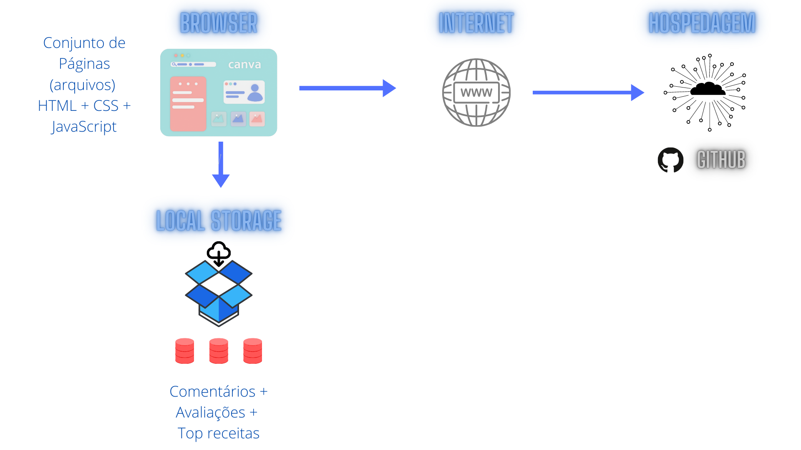

# Arquitetura da Solução

A partir de uma solução elaborada pela equipe, foram definidos nesse tópico os componentes que fazem parte da arquitetura de solução do projeto e o ambiente no qual o mesmo será hospedado.

## Diagrama de componentes

Os componentes representados a seguir, fazem parte da solução elaborada para o projeto.

 Arquitetura da Solução 

O diagrama de componentes apresenta os seguinte itens:
- **Browser** - Interface básica do navegador utilizado pelo usuário.
  - **Páginas Web** - Conjunto de arquivos HTML, CSS, JavaScript e imagens que implementam as funcionalidades do sistema, sendo assim o modulo de interação do usuário com a aplicação.
   - **Local Storage** - armazenamento de dados mantido no Navegador do usuário, onde são implementados bancos de dados baseados em JSON. Sendo eles: 
     - **Comentários** - registro das opiniões dos usuários sobre as receitas 
     - **Avaliações** - registro de avaliações dos usuários sobre as receitas
     - **Top receitas** - registro de receitas mais bem avaliadas pelos usuários
 - **Hospedagem** - Plataforma na internet na qual as páginas seram mantidas e acessadas pelo navegador dos usuários. 

## Tecnologias Utilizadas

O projeto irá utilizar das tecnologias de arquivos HTML, CSS e JavaScript para sua execução, sendo desenvolvido atravéz do IDE Visual Studio Code. Como objetivo geral a plataforma irá conter:
- Landing page com uma barra de pesquisas para busca de receitas;
- Top receitas mais acessadas na “landing page”;
- Menu de navegação no topo da página (barra horizontal: início, sobre, receitas, contato, blog); 
- Segmentação de receitas de acordo com o tipo de restrição ou tipo de refeição;
- Área de cadastro para usuários receberem novas receitas por email e enviar suas receitas;
- Blog interno que trata das restrições alimentares com dicas e receitas;

## Hospedagem

O projeto do site utiliza a plataforma Github como ambiente para hospedagem. 
A publicação do site no Github é feita através da criação de um repositório para desenvolvimento do projeto, depois é feito envio dos arquivos para o repositório por meio de submissão (push), depois é feito o deploy do site com a ferramenta do Github Pages.
