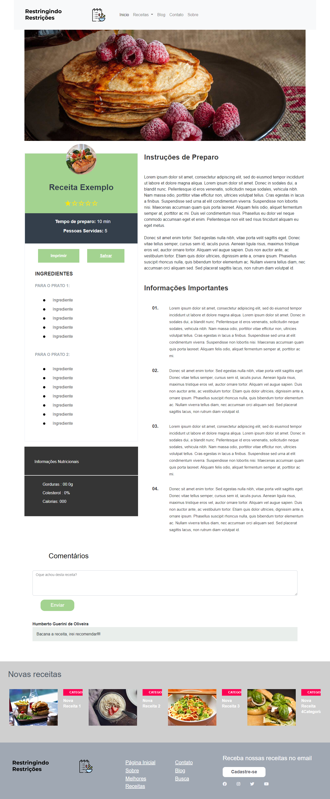
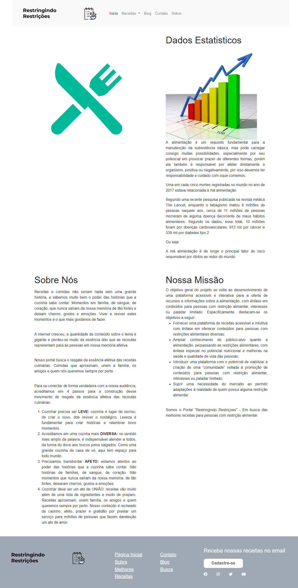
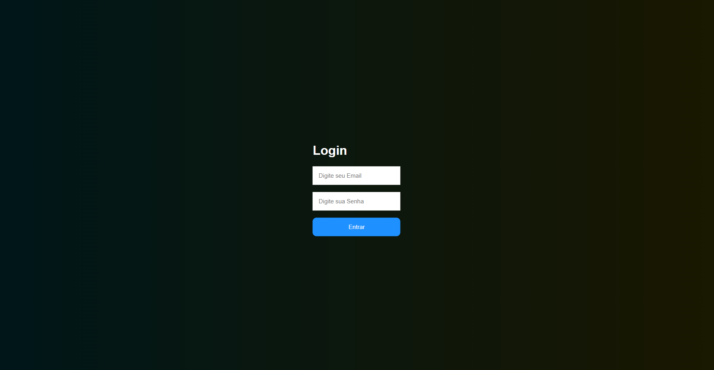
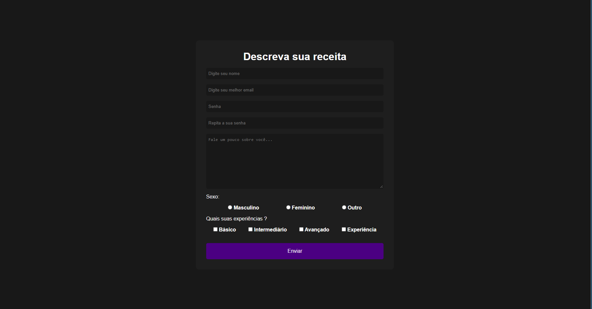

# Template padrão do site

O template padrão de layout do projeto segue conforme foi desenvolvido no tópico de projeto de interface anteriormente, conforme mostrado a seguir.

// 

O template do projeto desenvolvido está disponivel no link ... sendo composto pelos layouts:
> - Página Inicial
> - Tela de busca
> - Tela de Receitas
> - Tela de Blog
> - Tela de Contato
> - Tela de Sobre e Estatísticas
> - Tela de Login
> - Tela de Cadastro

**1. Página Inicial**

Tela que abrange o conteúdo inicial do site e receitas diversas para interação do usuário.

IMAGEM DA TELA

**2. Tela de Busca**

Tela para navegação e pesquisa de receitas a serem exploradas pelo usuário.

IMAGEM DA TELA

**3. Tela de Receitas**

Tela de exibição e interação do usuário com o conteúdo das receitas.

**4. Tela de Blog**

Tela com informações e que possam atrair a leitura e conhecimento dos usuários.

IMAGEM DA TELA

**5. Tela de Contato**

Tela com formulário para contato dos usuários com a administração do site.

IMAGEM DA TELA

**6. Tela de Sobre e Estatísticas**

Tela de exibição da proposta e história do projeto.

**7. Tela de Login**

Tela para o usuário acessar sua conta.

**8. Tela de Cadastro**

Tela para cadastro do usuário.

