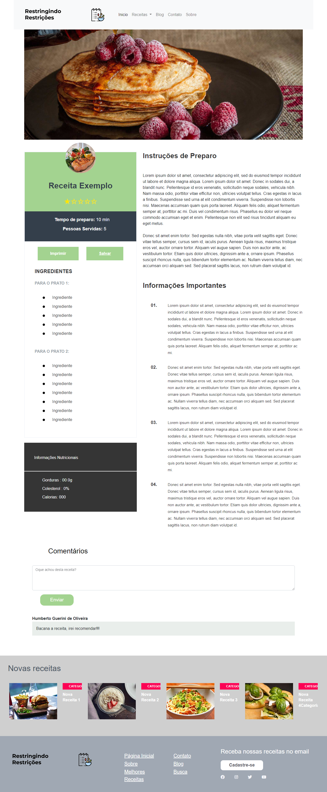

# Programação de Funcionalidades

Neste tópico é apresentado o desenvolvimento elaborado para funcionalidade das telas do projeto e quais requisitos propostos elas atendem. Será mostrado na sequência o link para acesso de cada uma das telas desenvolvidas.

**1. Página Inicial**

**2. Tela de Busca**

**3. Tela de Receitas**

Requisitos atendidos
-	RF-02
-	RF-04
-	RF-05
-	RF-07 

Artefatos da funcionalidade
-	receitas.html
-	script.js
-	style-pag-receitas.css
-	logo.jpg
-	little-logo.jpg
-	footer-logo.jpg
-	intro-img.jpg
-	nova-1.jpg
-	nova-2.jpg
-	nova-3.jpg
-	nova-4.jpg
-	receita-1.jpg

Estrutura de Dados

Instruções de acesso
-	Abra um navegador de Internet e informe a seguinte URL: ⦁	xxxxxxxxx

**4. Tela de Blog**

**5. Tela de Contato**

**6. Tela de Sobre e Estatísticas**

Requisitos atendidos
-	RF-08 

Artefatos da funcionalidade
-	sobre.html
-	script.js
-	style-pag-sobre.css
-	logo.jpg
-	little-logo.jpg
-	footer-logo.jpg
-	grafico.jpg
-	icone.jpg

Estrutura de Dados

Instruções de acesso
-	Abra um navegador de Internet e informe a seguinte URL: ⦁	xxxxxxxxx

**7. Tela de Login**

**8. Tela de Cadastro**

